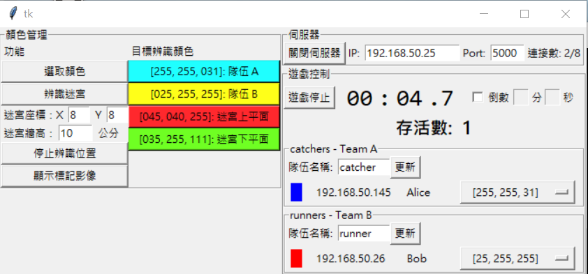

# Game "Run and Catch" #

需由兩方進行的遊戲，一方扮演逃亡者 (Runner)，另一方扮演追逐者 (Catcher)，
逃亡者必須在時限內不被追逐者抓到，或是達成指定的目標。
追逐者則必須在逃亡者完成目標前抓到所有逃亡者。

## 使用遊戲 ##

在 `application_gui.py` 中，將包含遊戲的 module 替換成 `game_run_and_catch`，
如：
```python
from game_run_and_catch import GameCore, GameConsoleWidget
```

## 遊戲指令 ##

**由 server 發出**
* `game-start`：遊戲開始
* `game-stop`：遊戲結束
* `game-catched`：(只有逃亡方才會收到)，被判定被追逐方抓到

**由玩家發出**

* `position`：取得自己在迷宮中的位置，server 回傳 `position <x> <y>`
* `position-team`：取得隊友 (包括自己) 在迷宮中的位置
  + server 回傳 `position-team [<ID> <x> <y>]+`，
   例如：`position-team Bob 2 3 Alice 3 5`
* `position-enemy`：取得敵方在迷宮中的位置
  + server 回傳 `position-enemy [<x> <y>]+`，例如：`position-enemy 1 2 0 3`
* `game-touch`：(只有逃亡方發出有效)，完成指定的目標

## 遊戲流程 ##

1. 確認兩方已經連上遊戲，並指定好對應的辨識顏色
2. 設定計時器模式 (計時或倒數)
3. 按"遊戲開始"鍵開始遊戲，server 廣播 `game-start` 訊息，並開始計時
4. Server 持續判定逃亡者是否被追逐者抓到，如果有則發出 `game-catched` 訊息給逃亡者
5. 檢查場上是否還有存活的追逐者，如果沒有則結束遊戲，發出 `game-stop` 訊息，計時停止

其他遊戲結束的情況，視玩法而定：

* 由控制介面直接結束遊戲
* 逃亡方完成目標
* 計時器倒數結束 (如果設為倒數模式的話)

## 遊戲介面 ##



如果該逃亡者還存活，其顏色標籤為紅色，否則為灰色